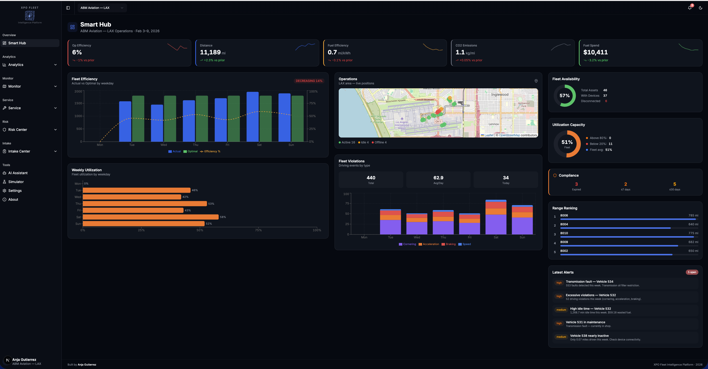
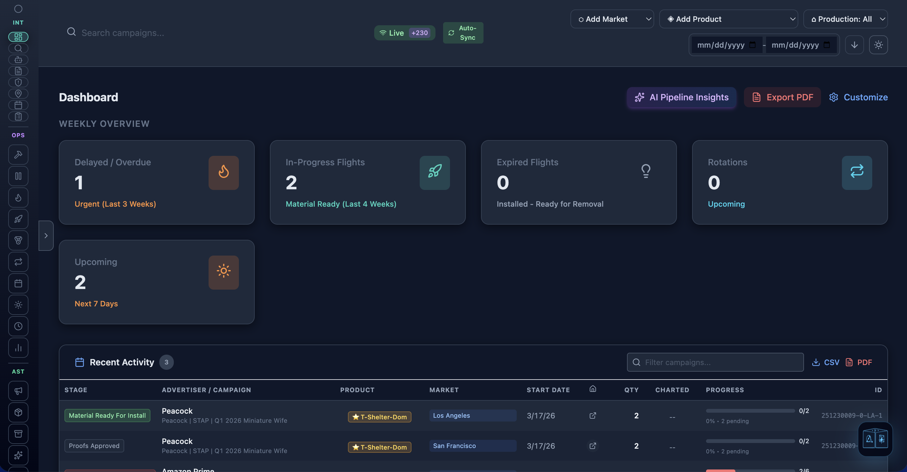
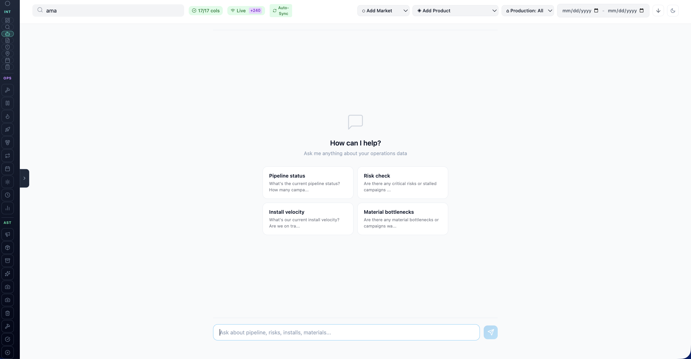
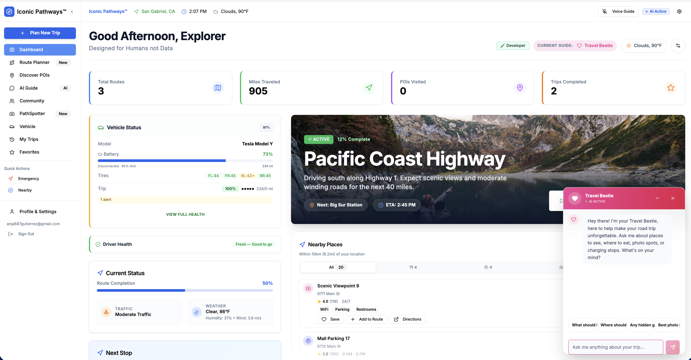
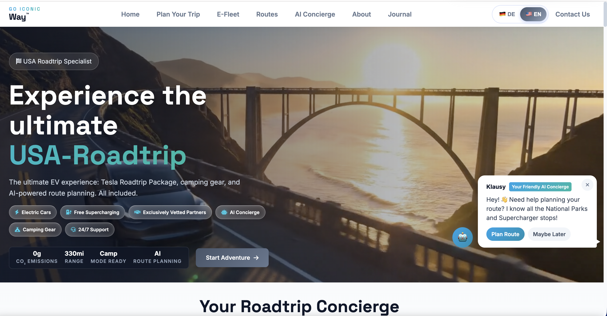
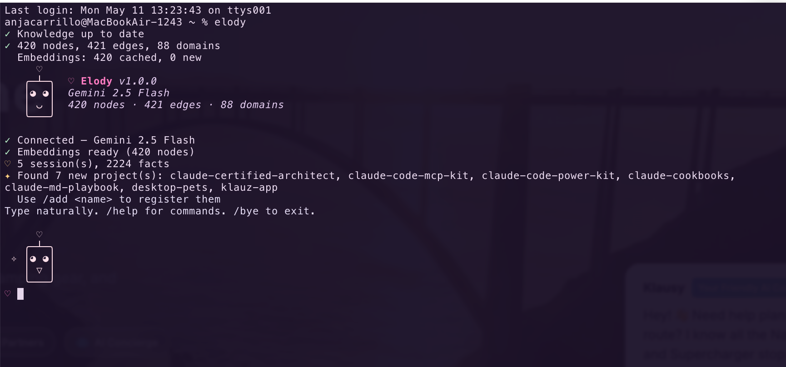
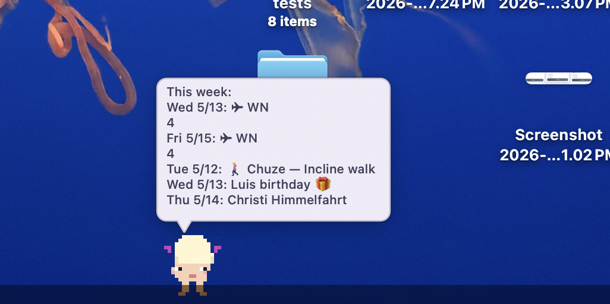
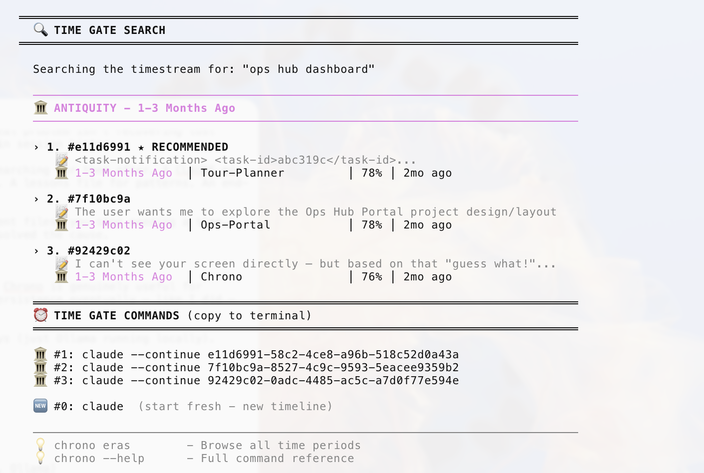
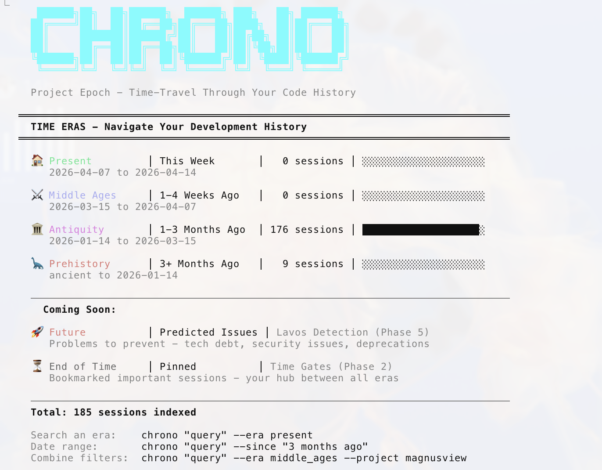

# Anja Gutierrez — Portfolio

Full-stack developer and AI builder based in Los Angeles. I build production tools from original research — operations dashboards, AI assistants, mobile apps, SaaS platforms, and developer tooling.

**12+ production projects** | **React / Next.js / React Native** | **Firebase / Supabase / Cloudflare** | **AI-native workflow**

---

## XPO Fleet Intelligence

A 23-page fleet management dashboard built from 10 research documents and 16 real data exports. Includes original features — a 6-tier compliance engine, digitized CHP inspection forms, and vehicle-specific PM schedules — that don't exist in the reference platform.

**Next.js 15** | **React 19** | **Tailwind CSS 4** | **shadcn/ui** | **Recharts** | **TypeScript**

| Pages | Lines of Code | Entity Types | TS Errors |
|-------|--------------|--------------|-----------|
| 23 | 29,000+ | 21 | 0 |

[GitHub](https://github.com/anja687gutierrez-jpg/xpo-fleet)

---

## Ops Hub v2

Production operations portal managing 860+ OOH transit advertising campaigns across LA. Zero build tools — 1.3 MB SPA running on Cloudflare Pages. Features Victor AI concierge with deterministic intelligence, admin/viewer RBAC, real-time Google Sheets sync, batch shipment tracking, canvas-rendered gear sidebar, and 4-layer IndexedDB persistence.

**React 18 (CDN)** | **Tailwind CSS** | **Three.js** | **Cloudflare Workers + KV** | **IndexedDB** | **Google Sheets API**

| Campaigns | Lines of Code | Build Size | Build Tools |
|-----------|--------------|------------|-------------|
| 860+ | 25,000+ | 1.3 MB | 0 |

Victor AI Assistant

[Live Site](https://ops-hub-mobile.pages.dev) | [Full Case Study](https://github.com/anja687gutierrez-jpg/ops-hub-portfolio)

---

## Tour Route Planner

AI-powered road trip planning with interactive maps, route optimization, drag-and-drop itinerary editing, Firebase Auth, and a voice assistant for hands-free navigation. Travel Bestie AI provides recommendations for nearby places, photo spots, and charging stops.

**React 18** | **TypeScript** | **Vite** | **Firebase** | **Leaflet**

[GitHub](https://github.com/anja687gutierrez-jpg/tour-route-planner)

---

## Abenteuer LIVE + GoIconicWay

Dual-brand bilingual (EN/DE) marketing sites for an EV campervan rental startup. Runtime language switching, Klausy AI Concierge, lead capture via Google Apps Script, optimized Core Web Vitals. Two Cloudflare Pages projects deployed from one monorepo via GitHub Actions.

**React 19** | **Vite 6** | **TypeScript** | **SSG** | **Cloudflare Pages** | **GitHub Actions**

[Live Site](https://abenteuer-mieten.pages.dev)

---

## Klauz App

A mobile knowledge engine with 17 screens, orbital compass navigation, and a 3-tier AI stack (Gemini, Groq, local knowledge fallback). Built from scratch in React Native with Expo.

**React Native** | **Expo** | **TypeScript** | **Gemini API** | **Groq API**

| Screens | Files | Lines of Code |
|---------|-------|--------------|
| 17 | 45 | 7,724 |

[GitHub](https://github.com/anja687gutierrez-jpg/klauz-app)

---

## Bob's StockPulse

Automated daily stock analysis platform. Scans portfolio holdings and market movers every morning, generates AI-powered trading signals with technical indicators, and delivers unified email reports via Resend. Architected for SaaS with Free/Pro tiers and Stripe billing.

**Next.js 16** | **AI SDK** | **yahoo-finance2** | **Cloudflare Workers** | **Stripe** | **Resend**

[GitHub](https://github.com/anja687gutierrez-jpg/bobs-stockpulse)

---

## Elody

Personal AI knowledge agent with 20 MCP tools. Natural language search over a 420-node knowledge graph, code search with project-aware routing, Chrome bookmark indexing, two-way SMS with auto-reply, session persistence, and git commit tracking across all repos. Includes an autonomous loop engine with plan generation and circuit breaker.

**Node.js** | **Gemini 2.5 Flash** | **Ollama** | **MCP SDK** | **Ink TUI**

[GitHub](https://github.com/anja687gutierrez-jpg/elody)

---

## Woolly (Desktop Pets)

A macOS desktop pet — a pixel art sheep that wanders your screen, reads your calendar, searches your knowledge graph (110 nodes), and chats via Ollama. Blows kisses on command. Auto-launches via launchd.

**Swift** | **macOS native** | **Ollama** | **EventKit**

[GitHub](https://github.com/anja687gutierrez-jpg/desktop-pets)

---

## Chrono

A developer CLI with Chrono Trigger-inspired time mechanics. Semantic search over 57+ indexed coding sessions using ChromaDB, session bookmarking, era-based filtering, and ASCII art time periods.

**Python** | **ChromaDB** | **Ollama** | **CLI**

Time Eras

[GitHub](https://github.com/anja687gutierrez-jpg/chrono-open)

---

## Additional Projects

| Project | Stack | Description |
|---------|-------|-------------|
| **Abenteuer Platform** | Next.js 15, Supabase, Stripe, Three.js | Multi-tenant SaaS marketplace with 3-role auth and full booking pipeline |
| **MagnusView** | React 18, Firebase, Tailwind | Drive-based content delivery app on Firebase Hosting |
| **Thought Graph** | Vanilla JS, 3d-force-graph, Three.js | 3D knowledge visualization — 101 nodes, 403 wikilinks, 3 topology modes |

---

## Developer Products

I sell developer guides and starter kits on [Gumroad](https://products.goiconicway.com):

| Product | Price |
|---------|-------|
| **The CLAUDE.md Playbook** — 10-chapter guide + 20 templates + 6 hooks | $49 |
| **Zero-Cost Business Dashboard** — Guide + working starter app + 16 E2E tests | $79 |
| **Claude Code Power Kit** — 7 skills + 5 CLI refs + memory architecture | $29 |
| **Claude Code MCP Starter Kit** — 4 MCP server templates + 2 production examples | $29 |
| **No-Build React Blueprint** — 8-chapter guide + starter template | $19 |
| **Claude Code Cheat Sheet** — Free one-page reference | Free |

---

## Technical Range

| Area | Technologies |
|------|-------------|
| **Frontend** | React 18/19, Next.js 15/16, React Native, Expo, TypeScript, Tailwind CSS 4, Three.js, Vite 6 |
| **Backend** | Node.js, Cloudflare Workers, Vercel Serverless, Google Apps Script |
| **Databases** | Firebase, Supabase, IndexedDB, Drizzle ORM |
| **Payments** | Stripe (PaymentIntent, Identity, Connect, Webhooks) |
| **AI / ML** | Groq, Google Gemini 2.5, Ollama, RAG pipelines, MCP |
| **Infrastructure** | Cloudflare Pages/Workers, Vercel, Firebase Hosting, GitHub Actions |
| **Graphics** | Three.js, HTML5 Canvas, 3d-force-graph, SVG |
| **Mobile** | React Native, Expo, Device Camera API |

---

## About

I'm an operations coordinator turned full-stack developer. I build the tools my team actually needs — then ship them to production and maintain them myself. I don't work from templates. I architect systems from scratch using original research.

I build in collaboration with Claude Code — I bring domain expertise and product vision, every commit is co-authored. That's how modern software gets built.

**Los Angeles, CA** | [GitHub](https://github.com/anja687gutierrez-jpg) | [Email](mailto:anja687gutierrez@gmail.com) | [Developer Tools & Guides](https://products.goiconicway.com)

See [WORK-WITH-ANJA.md](WORK-WITH-ANJA.md) for services, philosophy, and full project descriptions.
